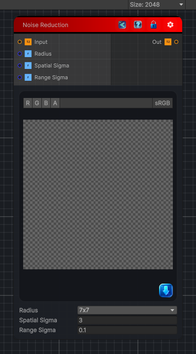

<link rel="stylesheet" href="../_assets/theme.css">

<button type="button" class="genesis-theme-toggle" data-genesis-theme-toggle aria-label="Toggle theme">Dark</button>

---
category: "Filters/Enhance"
---

# Noise Reduction

> Noise reduction using an edge-preserving bilateral filter. Each pixel is averaged with its neighbours, but neighbours are weighted by both spatial distance and color similarity, so flat noisy regions are smoothed while edges and detail are preserved. Radius is the kernel half-size. Spatial Sigma controls how far the smoothing reaches. Range Sigma is the edge threshold: smaller values preserve edges more aggressively, larger values smooth across them. Alpha is taken from the input and is not modified.

## Description

Noise reduction using an edge-preserving bilateral filter. Each pixel is averaged with its neighbours, but neighbours are weighted by both spatial distance and color similarity, so flat noisy regions are smoothed while edges and detail are preserved. Radius is the kernel half-size. Spatial Sigma controls how far the smoothing reaches. Range Sigma is the edge threshold: smaller values preserve edges more aggressively, larger values smooth across them. Alpha is taken from the input and is not modified.

## Inputs

| Name | Type | Description |
|------|------|-------------|

## Outputs

| Name | Type |
|------|------|

## Parameters

| Setting | Type | Default | Description |
|---------|------|---------|-------------|
| Radius | int | 3 | Controls the radius. |
| Spatial Sigma | Float | 3.0 | Controls the spatial sigma. |
| Range Sigma | Float | 0.1 | Controls the range sigma. |

## See Also

- [Back to Noise Reduction](./filters-index.md)
