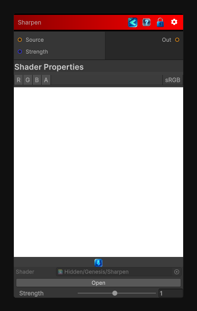

<link rel="stylesheet" href="../_assets/theme.css">

<button type="button" class="genesis-theme-toggle" data-genesis-theme-toggle aria-label="Toggle theme">Dark</button>

---
category: "Filters/Enhance"
---

# Sharpen

> Sharpen the input image using a very simple 3x3 sharpening kernel.

## Description

Sharpen the input image using a very simple 3x3 sharpening kernel.

## Inputs

| Name | Type | Description |
|------|------|-------------|

## Outputs

| Name | Type |
|------|------|

## Parameters

| Setting | Type | Default | Description |
|---------|------|---------|-------------|
| Strength | Range | 1 | Controls the strength. |

## See Also

- [Back to Sharpen](./filters-index.md)
