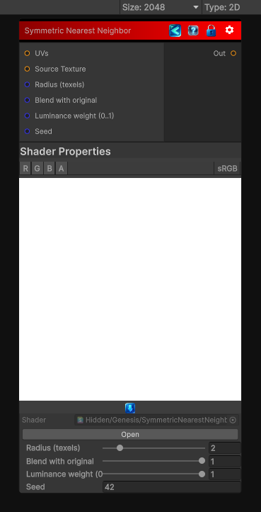

<link rel="stylesheet" href="../_assets/theme.css">

<button type="button" class="genesis-theme-toggle" data-genesis-theme-toggle aria-label="Toggle theme">Dark</button>

---
category: "Filters/Enhance"
---

# Symmetric Nearest Neighbor

> symmetric nearest‑neighbor smoothing filter. For each symmetric pair of samples (left/right and up/down) at each radius step the shader picks the sample that is closer in luminance to the center (nearest neighbor in appearance) and accumulates those chosen samples. This preserves edges and fine detail better than a naive box blur while still removing high‑frequency noise.

## Description

 symmetric nearest‑neighbor smoothing filter. For each symmetric pair of samples (left/right and up/down) at each radius step the shader picks the sample that is closer in luminance to the center (nearest neighbor in appearance) and accumulates those chosen samples. This preserves edges and fine detail better than a naive box blur while still removing high‑frequency noise.

## Inputs

| Name | Type | Description |
|------|------|-------------|

## Outputs

| Name | Type |
|------|------|

## Parameters

| Setting | Type | Default | Description |
|---------|------|---------|-------------|
| Source Texture | 2D | white | Controls the source texture. |
| Radius (texels) | Range | 2 | Controls the radius (texels). |
| Blend with original | Range | 1.0 | Controls the blend with original. |
| Luminance weight (0..1) | Range | 1.0 | Controls the luminance weight (0..1). |
| Seed | Int | 42 | Controls the seed. |

## See Also

- [Back to Symmetric Nearest Neighbor](./filters-index.md)
