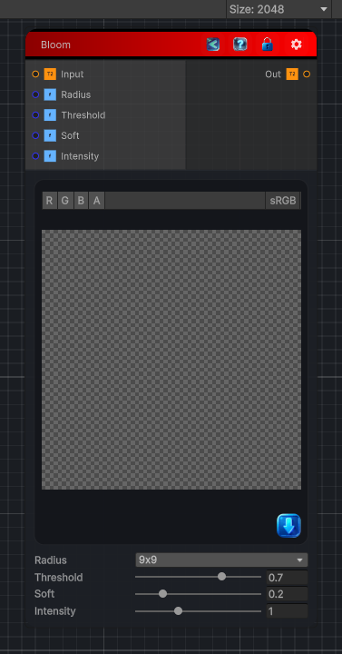

<link rel="stylesheet" href="../_assets/theme.css">

<button type="button" class="genesis-theme-toggle" data-genesis-theme-toggle aria-label="Toggle theme">Dark</button>

---
category: "Filters/Light and Shadow"
---

# Bloom

> Bloom effect. Extracts the bright parts of the image above a luminance threshold, softly blurs them with a gaussian, and adds the glow back onto the original. Threshold controls what counts as bright, Soft is the knee width of the threshold, Intensity scales the added glow, and Radius sets the blur size of the bloom. Output can exceed 1 for HDR-friendly compositing. Alpha is taken from the input and is not modified.

## Description

Bloom effect. Extracts the bright parts of the image above a luminance threshold, softly blurs them with a gaussian, and adds the glow back onto the original. Threshold controls what counts as bright, Soft is the knee width of the threshold, Intensity scales the added glow, and Radius sets the blur size of the bloom. Output can exceed 1 for HDR-friendly compositing. Alpha is taken from the input and is not modified.

## Inputs

| Name | Type | Description |
|------|------|-------------|
| Input | Texture2D |  |
| Radius | Single |  |
| Threshold | Single |  |
| Soft | Single |  |
| Intensity | Single |  |

## Outputs

| Name | Type |
|------|------|
| Out | Texture2D |

## Parameters

| Setting | Type | Default | Description |
|---------|------|---------|-------------|
| Radius | int | 4 | Controls the radius. |
| Threshold | Range | 0.7 | Controls the threshold. |
| Soft | Range | 0.2 | Controls the soft. |
| Intensity | Range | 1 | Controls the intensity. |

## See Also

- [Back to Bloom](./filters-index.md)
