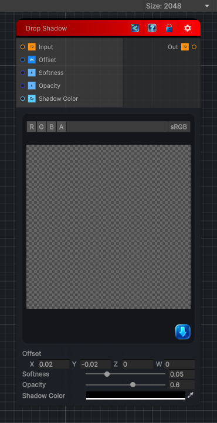

<link rel="stylesheet" href="../_assets/theme.css">

<button type="button" class="genesis-theme-toggle" data-genesis-theme-toggle aria-label="Toggle theme">Dark</button>

---
category: "Filters/Light and Shadow"
---

# Drop Shadow

> Drop shadow. Casts a soft shadow behind the input using the input alpha channel as the shape, then composites the shadow under the original so the result is ready to use. Offset shifts the shadow, Softness blurs its edge, Opacity scales it, and Shadow Color tints it. Feed a layer or shape with transparency (the alpha defines what casts the shadow). The shadow is composited over transparent, so the output alpha includes the shadow.

## Description

Drop shadow. Casts a soft shadow behind the input using the input alpha channel as the shape, then composites the shadow under the original so the result is ready to use. Offset shifts the shadow, Softness blurs its edge, Opacity scales it, and Shadow Color tints it. Feed a layer or shape with transparency (the alpha defines what casts the shadow). The shadow is composited over transparent, so the output alpha includes the shadow.

## Inputs

| Name | Type | Description |
|------|------|-------------|

## Outputs

| Name | Type |
|------|------|

## Parameters

| Setting | Type | Default | Description |
|---------|------|---------|-------------|
| Offset | Vector | (0.02,-0.02,0,0) | Controls the offset. |
| Softness | Range | 0.05 | Controls the softness. |
| Opacity | Range | 0.6 | Controls the opacity. |
| Shadow Color | Color | (0,0,0,1) | Controls the shadow color. |

## See Also

- [Back to Drop Shadow](./filters-index.md)
