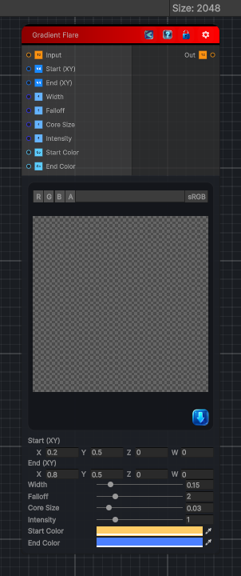

<link rel="stylesheet" href="../_assets/theme.css">

<button type="button" class="genesis-theme-toggle" data-genesis-theme-toggle aria-label="Toggle theme">Dark</button>

---
category: "Filters/Light and Shadow"
---

# Gradient Flare

> Gradient flare effect. A soft directional light that ramps from a bright Start point to an End point: a gaussian cross-section band whose color grades from Start Color to End Color along the axis, with a bright core at the source. Width sets how far the glow spreads perpendicular to the axis, Falloff controls how quickly it dims toward the End, and Intensity scales the light. Output can exceed 1 for HDR-friendly compositing. Alpha is taken from the input and is not modified.

## Description

Gradient flare effect. A soft directional light that ramps from a bright Start point to an End point: a gaussian cross-section band whose color grades from Start Color to End Color along the axis, with a bright core at the source. Width sets how far the glow spreads perpendicular to the axis, Falloff controls how quickly it dims toward the End, and Intensity scales the light. Output can exceed 1 for HDR-friendly compositing. Alpha is taken from the input and is not modified.

## Inputs

| Name | Type | Description |
|------|------|-------------|
| Input | Texture2D |  |
| Start (XY) | Vector4 |  |
| End (XY) | Vector4 |  |
| Width | Single |  |
| Falloff | Single |  |
| Core Size | Single |  |
| Intensity | Single |  |
| Start Color | Color |  |
| End Color | Color |  |

## Outputs

| Name | Type |
|------|------|
| Out | Texture2D |

## Parameters

| Setting | Type | Default | Description |
|---------|------|---------|-------------|
| Start (XY) | Vector | (0.2,0.5,0,0) | Controls the start (xy). |
| End (XY) | Vector | (0.8,0.5,0,0) | Controls the end (xy). |
| Width | Range | 0.15 | Controls the width. |
| Falloff | Range | 2 | Controls the falloff. |
| Core Size | Range | 0.03 | Controls the core size. |
| Intensity | Range | 1 | Controls the intensity. |
| Start Color | Color | (1,0.8,0.4,1) | Controls the start color. |
| End Color | Color | (0.3,0.5,1,1) | Controls the end color. |

## See Also

- [Back to Gradient Flare](./filters-index.md)
