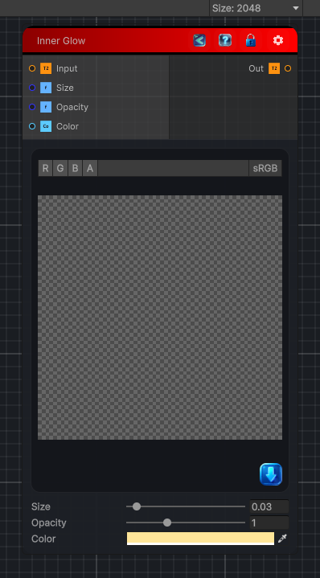

<link rel="stylesheet" href="../_assets/theme.css">

<button type="button" class="genesis-theme-toggle" data-genesis-theme-toggle aria-label="Toggle theme">Dark</button>

---
category: "Filters/Light and Shadow"
---

# Inner Glow

> Inner glow. Adds a colored glow just inside the edge of the shape defined by the input alpha, fading inward. Size sets how far the glow reaches from the edge, Color tints it, and Opacity scales it. The glow is added to the input only where the shape exists, so the silhouette (alpha) is unchanged. Feed a layer or shape with transparency. Alpha is taken from the input and is not modified.

## Description

Inner glow. Adds a colored glow just inside the edge of the shape defined by the input alpha, fading inward. Size sets how far the glow reaches from the edge, Color tints it, and Opacity scales it. The glow is added to the input only where the shape exists, so the silhouette (alpha) is unchanged. Feed a layer or shape with transparency. Alpha is taken from the input and is not modified.

## Inputs

| Name | Type | Description |
|------|------|-------------|
| Input | Texture2D |  |
| Size | Single |  |
| Opacity | Single |  |
| Color | Color |  |

## Outputs

| Name | Type |
|------|------|
| Out | Texture2D |

## Parameters

| Setting | Type | Default | Description |
|---------|------|---------|-------------|
| Size | Range | 0.03 | Controls the size. |
| Opacity | Range | 1 | Controls the opacity. |
| Color | Color | (1,0.9,0.6,1) | Controls the color. |

## See Also

- [Back to Inner Glow](./filters-index.md)
