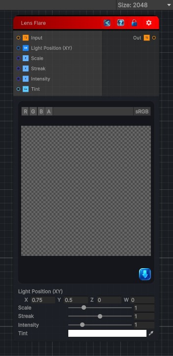

<link rel="stylesheet" href="../_assets/theme.css">

<button type="button" class="genesis-theme-toggle" data-genesis-theme-toggle aria-label="Toggle theme">Dark</button>

---
category: "Filters/Light and Shadow"
---

# Lens Flare

> Lens flare effect. Generates a cinematic lens flare from a light position: a bright core and anamorphic horizontal streak at the light, plus a series of colored ghost circles spread along the axis that runs from the light through the screen center to the opposite side. Light Position sets the source, Scale sizes the flare, Streak controls the anamorphic horizontal beam (0 disables it), Intensity scales the light, and Tint colors it. Output can exceed 1 for HDR-friendly compositing. Alpha is taken from the input and is not modified.

## Description

Lens flare effect. Generates a cinematic lens flare from a light position: a bright core and anamorphic horizontal streak at the light, plus a series of colored ghost circles spread along the axis that runs from the light through the screen center to the opposite side. Light Position sets the source, Scale sizes the flare, Streak controls the anamorphic horizontal beam (0 disables it), Intensity scales the light, and Tint colors it. Output can exceed 1 for HDR-friendly compositing. Alpha is taken from the input and is not modified.

## Inputs

| Name | Type | Description |
|------|------|-------------|

## Outputs

| Name | Type |
|------|------|

## Parameters

| Setting | Type | Default | Description |
|---------|------|---------|-------------|
| Light Position (XY) | Vector | (0.75,0.5,0,0) | Controls the light position (xy). |
| Scale | Range | 1 | Controls the scale. |
| Streak | Range | 1 | Controls the streak. |
| Intensity | Range | 1 | Controls the intensity. |
| Tint | Color | (1,1,1,1) | Controls the tint. |

## See Also

- [Back to Lens Flare](./filters-index.md)
