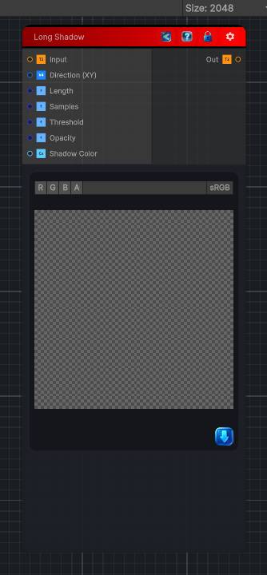

<link rel="stylesheet" href="../_assets/theme.css">

<button type="button" class="genesis-theme-toggle" data-genesis-theme-toggle aria-label="Toggle theme">Dark</button>

---
category: "Filters/Light and Shadow"
---

# Long Shadow

> Long shadow. Casts a long fading shadow from the input alpha (the shape) along a direction, marching toward the light to find where the shape blocks it. The shadow is darkest next to the shape and fades out over Length, then is composited under the original so the result is ready to use. Direction is the cast direction, Length the extent, Samples the march quality, Threshold the alpha cutoff for the shape, Opacity the strength, and Shadow Color the tint. Feed a layer or shape with transparency. The shadow is composited over transparent, so the output alpha includes the shadow.

## Description

Long shadow. Casts a long fading shadow from the input alpha (the shape) along a direction, marching toward the light to find where the shape blocks it. The shadow is darkest next to the shape and fades out over Length, then is composited under the original so the result is ready to use. Direction is the cast direction, Length the extent, Samples the march quality, Threshold the alpha cutoff for the shape, Opacity the strength, and Shadow Color the tint. Feed a layer or shape with transparency. The shadow is composited over transparent, so the output alpha includes the shadow.

## Inputs

| Name | Type | Description |
|------|------|-------------|
| Input | Texture2D |  |
| Direction (XY) | Vector4 |  |
| Length | Single |  |
| Samples | Single |  |
| Threshold | Single |  |
| Opacity | Single |  |
| Shadow Color | Color |  |

## Outputs

| Name | Type |
|------|------|
| Out | Texture2D |

## Parameters

| Setting | Type | Default | Description |
|---------|------|---------|-------------|
| Direction (XY) | Vector | (0.7,0.7,0,0) | Controls the direction (xy). |
| Length | Range | 0.3 | Controls the length. |
| Samples | Range | 32 | Controls the samples. |
| Threshold | Range | 0.5 | Controls the threshold. |
| Opacity | Range | 0.7 | Controls the opacity. |
| Shadow Color | Color | (0,0,0,1) | Controls the shadow color. |

## See Also

- [Back to Long Shadow](./filters-index.md)
