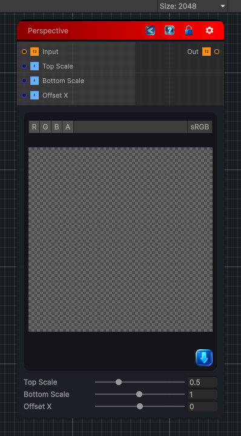

<link rel="stylesheet" href="../_assets/theme.css">

<button type="button" class="genesis-theme-toggle" data-genesis-theme-toggle aria-label="Toggle theme">Dark</button>

---
category: "Filters/Light and Shadow"
---

# Perspective

> Perspective (one-point keystone) transform. Warps the image into a trapezoid that recedes toward a vanishing point, simulating a plane seen in perspective. Top Scale and Bottom Scale control the horizontal compression at the top and bottom of the image (a smaller Top Scale recedes upward), and Offset X shifts the vanishing point horizontally. Areas that fall outside the source after the warp become transparent.

## Description

Perspective (one-point keystone) transform. Warps the image into a trapezoid that recedes toward a vanishing point, simulating a plane seen in perspective. Top Scale and Bottom Scale control the horizontal compression at the top and bottom of the image (a smaller Top Scale recedes upward), and Offset X shifts the vanishing point horizontally. Areas that fall outside the source after the warp become transparent.

## Inputs

| Name | Type | Description |
|------|------|-------------|
| Input | Texture2D |  |
| Top Scale | Single |  |
| Bottom Scale | Single |  |
| Offset X | Single |  |

## Outputs

| Name | Type |
|------|------|
| Out | Texture2D |

## Parameters

| Setting | Type | Default | Description |
|---------|------|---------|-------------|
| Top Scale | Range | 0.5 | Controls the top scale. |
| Bottom Scale | Range | 1.0 | Controls the bottom scale. |
| Offset X | Range | 0 | Controls the offset x. |

## See Also

- [Back to Perspective](./filters-index.md)
