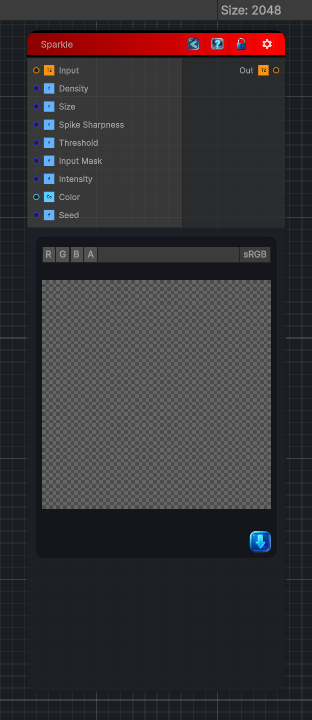

<link rel="stylesheet" href="../_assets/theme.css">

<button type="button" class="genesis-theme-toggle" data-genesis-theme-toggle aria-label="Toggle theme">Dark</button>

---
category: "Filters/Light and Shadow"
---

# Sparkle

> Sparkle effect. Scatters small twinkling 4-point star sparkles across the image using a hashed grid: each cell optionally hosts a sparkle at a random position, with a random brightness, size and rotation. Density is the cell size (smaller = more potential sparkles), Size scales each star, Spike Sharpness narrows the rays, Threshold controls how many cells actually produce a sparkle, Intensity scales the light, Color tints it, and Input Mask blends between sparkles everywhere (0) and sparkles only over bright parts of the input (1). Output can exceed 1 for HDR-friendly compositing. Alpha is taken from the input and is not modified.

## Description

Sparkle effect. Scatters small twinkling 4-point star sparkles across the image using a hashed grid: each cell optionally hosts a sparkle at a random position, with a random brightness, size and rotation. Density is the cell size (smaller = more potential sparkles), Size scales each star, Spike Sharpness narrows the rays, Threshold controls how many cells actually produce a sparkle, Intensity scales the light, Color tints it, and Input Mask blends between sparkles everywhere (0) and sparkles only over bright parts of the input (1). Output can exceed 1 for HDR-friendly compositing. Alpha is taken from the input and is not modified.

## Inputs

| Name | Type | Description |
|------|------|-------------|
| Input | Texture2D |  |
| Density | Single |  |
| Size | Single |  |
| Spike Sharpness | Single |  |
| Threshold | Single |  |
| Input Mask | Single |  |
| Intensity | Single |  |
| Color | Color |  |
| Seed | Single |  |

## Outputs

| Name | Type |
|------|------|
| Out | Texture2D |

## Parameters

| Setting | Type | Default | Description |
|---------|------|---------|-------------|
| Density | Range | 0.05 | Controls the density. |
| Size | Range | 0.5 | Controls the size. |
| Spike Sharpness | Range | 12 | Controls the spike sharpness. |
| Threshold | Range | 0.5 | Controls the threshold. |
| Input Mask | Range | 0 | Controls the input mask. |
| Intensity | Range | 1 | Controls the intensity. |
| Color | Color | (1,1,1,1) | Controls the color. |
| Seed | Float | 0 | Controls the seed. |

## See Also

- [Back to Sparkle](./filters-index.md)
