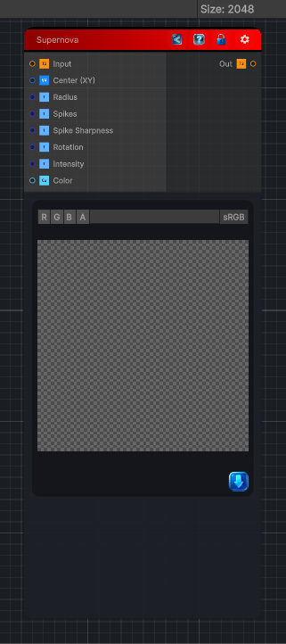

<link rel="stylesheet" href="../_assets/theme.css">

<button type="button" class="genesis-theme-toggle" data-genesis-theme-toggle aria-label="Toggle theme">Dark</button>

---
category: "Filters/Light and Shadow"
---

# Supernova

> Supernova light effect. Generates an additive radial starburst, a bright core with radiating spikes, and adds it onto the input image. Center positions the burst, Radius sets its overall extent, Spikes and Spike Sharpness control the number and narrowness of the rays, Rotation orients them, Intensity scales the light, and Color tints it. Output can exceed 1 for HDR-friendly compositing. Alpha is taken from the input and is not modified.

## Description

Supernova light effect. Generates an additive radial starburst, a bright core with radiating spikes, and adds it onto the input image. Center positions the burst, Radius sets its overall extent, Spikes and Spike Sharpness control the number and narrowness of the rays, Rotation orients them, Intensity scales the light, and Color tints it. Output can exceed 1 for HDR-friendly compositing. Alpha is taken from the input and is not modified.

## Inputs

| Name | Type | Description |
|------|------|-------------|

## Outputs

| Name | Type |
|------|------|

## Parameters

| Setting | Type | Default | Description |
|---------|------|---------|-------------|
| Center (XY) | Vector | (0.5,0.5,0,0) | Controls the center (xy). |
| Radius | Range | 0.5 | Controls the radius. |
| Spikes | Range | 6 | Controls the spikes. |
| Spike Sharpness | Range | 8 | Controls the spike sharpness. |
| Rotation | Range | 0 | Controls the rotation. |
| Intensity | Range | 1 | Controls the intensity. |
| Color | Color | (1,1,1,1) | Controls the color. |

## See Also

- [Back to Supernova](./filters-index.md)
