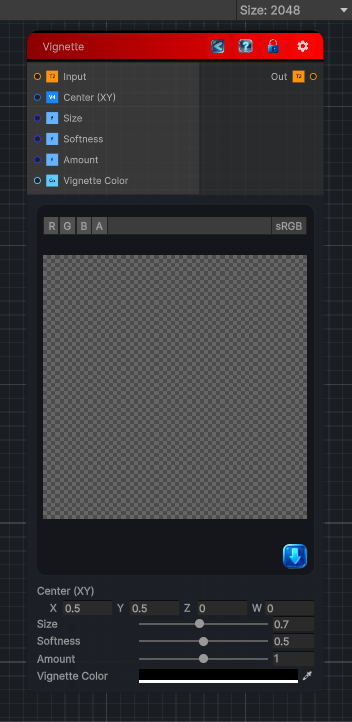

<link rel="stylesheet" href="../_assets/theme.css">

<button type="button" class="genesis-theme-toggle" data-genesis-theme-toggle aria-label="Toggle theme">Dark</button>

---
category: "Filters/Light and Shadow"
---

# Vignette

> Vignette. Darkens (or lightens) the edges of the image toward a color, leaving the center unaffected. Center positions the focal point, Size the radius where the falloff begins, Softness the width of the transition, Amount the strength, and Vignette Color the tint (black darkens the edges, white brightens them). Alpha is taken from the input and is not modified.

## Description

Vignette. Darkens (or lightens) the edges of the image toward a color, leaving the center unaffected. Center positions the focal point, Size the radius where the falloff begins, Softness the width of the transition, Amount the strength, and Vignette Color the tint (black darkens the edges, white brightens them). Alpha is taken from the input and is not modified.

## Inputs

| Name | Type | Description |
|------|------|-------------|

## Outputs

| Name | Type |
|------|------|

## Parameters

| Setting | Type | Default | Description |
|---------|------|---------|-------------|
| Center (XY) | Vector | (0.5,0.5,0,0) | Controls the center (xy). |
| Size | Range | 0.7 | Controls the size. |
| Softness | Range | 0.5 | Controls the softness. |
| Amount | Range | 1 | Controls the amount. |
| Vignette Color | Color | (0,0,0,1) | Controls the vignette color. |

## See Also

- [Back to Vignette](./filters-index.md)
