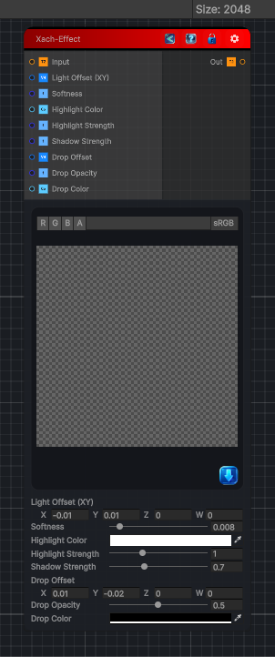

<link rel="stylesheet" href="../_assets/theme.css">

<button type="button" class="genesis-theme-toggle" data-genesis-theme-toggle aria-label="Toggle theme">Dark</button>

---
category: "Filters/Light and Shadow"
---

# Xach-Effect

> Xach-Effect: a glossy raised bevel, the classic GIMP-style lettering effect. Using the input alpha as the shape, it adds a soft highlight along the lit (top-left) inner edge, a dark inner shadow along the opposite edge, and a drop shadow behind, then composites everything with the original on top. Light Offset sets the lighting direction, Softness the bevel blur, Highlight Strength and Shadow Strength the bevel contrast, and the Shadow controls the drop shadow behind. Feed a layer or shape with transparency. The shadow is composited over transparent, so the output alpha includes the shadow.

## Description

Xach-Effect: a glossy raised bevel, the classic GIMP-style lettering effect. Using the input alpha as the shape, it adds a soft highlight along the lit (top-left) inner edge, a dark inner shadow along the opposite edge, and a drop shadow behind, then composites everything with the original on top. Light Offset sets the lighting direction, Softness the bevel blur, Highlight Strength and Shadow Strength the bevel contrast, and the Shadow controls the drop shadow behind. Feed a layer or shape with transparency. The shadow is composited over transparent, so the output alpha includes the shadow.

## Inputs

| Name | Type | Description |
|------|------|-------------|

## Outputs

| Name | Type |
|------|------|

## Parameters

| Setting | Type | Default | Description |
|---------|------|---------|-------------|
| Light Offset (XY) | Vector | (-0.01,0.01,0,0) | Controls the light offset (xy). |
| Softness | Range | 0.008 | Controls the softness. |
| Highlight Color | Color | (1,1,1,1) | Controls the highlight color. |
| Highlight Strength | Range | 1 | Controls the highlight strength. |
| Shadow Strength | Range | 0.7 | Controls the shadow strength. |
| Drop Offset | Vector | (0.01,-0.02,0,0) | Controls the drop offset. |
| Drop Opacity | Range | 0.5 | Controls the drop opacity. |
| Drop Color | Color | (0,0,0,1) | Controls the drop color. |

## See Also

- [Back to Xach-Effect](./filters-index.md)
