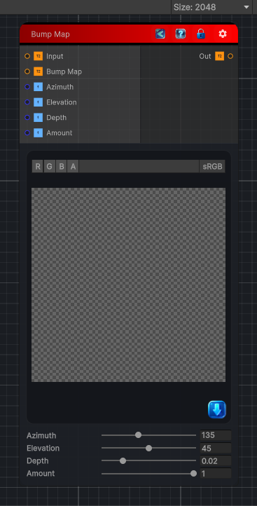

<link rel="stylesheet" href="../_assets/theme.css">

<button type="button" class="genesis-theme-toggle" data-genesis-theme-toggle aria-label="Toggle theme">Dark</button>

---
category: "Filters/Map"
---

# Bump Map

> Bump Map, like GIMP Map. Lights the input image using a bump map texture as a height field: the bump map's luminance defines a surface normal (via finite differences), which is shaded by an azimuth/elevation light and used to modulate the image. Connect a grayscale height/normal source to the Bump Map input. Azimuth and Elevation set the light direction, Depth the bump strength, and Ambient the base light.

## Description

Bump Map, like GIMP Map. Lights the input image using a bump map texture as a height field: the bump map's luminance defines a surface normal (via finite differences), which is shaded by an azimuth/elevation light and used to modulate the image. Connect a grayscale height/normal source to the Bump Map input. Azimuth and Elevation set the light direction, Depth the bump strength, and Ambient the base light.

## Inputs

| Name | Type | Description |
|------|------|-------------|

## Outputs

| Name | Type |
|------|------|

## Parameters

| Setting | Type | Default | Description |
|---------|------|---------|-------------|
| Azimuth | Range | 135 | Controls the azimuth. |
| Elevation | Range | 45 | Controls the elevation. |
| Depth | Range | 0.02 | Controls the depth. |
| Amount | Range | 1 | Controls the amount. |

## See Also

- [Back to Bump Map](./filters-index.md)
