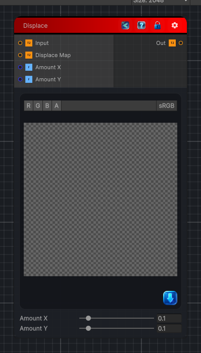

<link rel="stylesheet" href="../_assets/theme.css">

<button type="button" class="genesis-theme-toggle" data-genesis-theme-toggle aria-label="Toggle theme">Dark</button>

---
category: "Filters/Map"
---

# Displace

> Displace, like GIMP Map. Displaces each pixel of the input using a displacement map: the map's red channel shifts pixels horizontally and the green channel vertically, scaled by Amount X and Amount Y. Connect a displacement map to the Map input.

## Description

Displace, like GIMP Map. Displaces each pixel of the input using a displacement map: the map's red channel shifts pixels horizontally and the green channel vertically, scaled by Amount X and Amount Y. Connect a displacement map to the Map input.

## Inputs

| Name | Type | Description |
|------|------|-------------|
| Input | Texture2D |  |
| Displace Map | Texture2D |  |
| Amount X | Single |  |
| Amount Y | Single |  |

## Outputs

| Name | Type |
|------|------|
| Out | Texture2D |

## Parameters

| Setting | Type | Default | Description |
|---------|------|---------|-------------|
| Amount X | Range | 0.1 | Controls the amount x. |
| Amount Y | Range | 0.1 | Controls the amount y. |

## See Also

- [Back to Displace](./filters-index.md)
