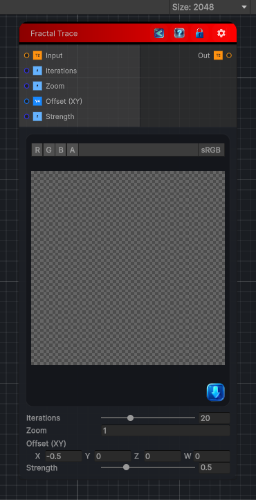

<link rel="stylesheet" href="../_assets/theme.css">

<button type="button" class="genesis-theme-toggle" data-genesis-theme-toggle aria-label="Toggle theme">Dark</button>

---
category: "Filters/Map"
---

# Fractal Trace

> Fractal Trace, like GIMP Map. Traces the image through a Mandelbrot fractal: each pixel's coordinate is run through the fractal for Iterations and the orbit value displaces the sample, so the image is warped along the fractal field. Zoom sizes the fractal plane, Offset centres it, and Strength scales the displacement.

## Description

Fractal Trace, like GIMP Map. Traces the image through a Mandelbrot fractal: each pixel's coordinate is run through the fractal for Iterations and the orbit value displaces the sample, so the image is warped along the fractal field. Zoom sizes the fractal plane, Offset centres it, and Strength scales the displacement.

## Inputs

| Name | Type | Description |
|------|------|-------------|

## Outputs

| Name | Type |
|------|------|

## Parameters

| Setting | Type | Default | Description |
|---------|------|---------|-------------|
| Iterations | Range | 20 | Controls the iterations. |
| Zoom | Float | 1 | Controls the zoom. |
| Offset (XY) | Vector | (-0.5,0,0,0) | Controls the offset (xy). |
| Strength | Range | 0.5 | Controls the strength. |

## See Also

- [Back to Fractal Trace](./filters-index.md)
