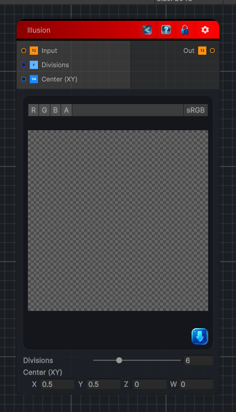

<link rel="stylesheet" href="../_assets/theme.css">

<button type="button" class="genesis-theme-toggle" data-genesis-theme-toggle aria-label="Toggle theme">Dark</button>

---
category: "Filters/Map"
---

# Illusion

> Illusion, like GIMP Map. Folds the image around a center into a mirrored kaleidoscope of Divisions wedges, producing a symmetric illusion pattern. Divisions sets the number of mirrored wedges and Center the pivot point.

## Description

Illusion, like GIMP Map. Folds the image around a center into a mirrored kaleidoscope of Divisions wedges, producing a symmetric illusion pattern. Divisions sets the number of mirrored wedges and Center the pivot point.

## Inputs

| Name | Type | Description |
|------|------|-------------|
| Input | Texture2D |  |
| Divisions | Single |  |
| Center (XY) | Vector4 |  |

## Outputs

| Name | Type |
|------|------|
| Out | Texture2D |

## Parameters

| Setting | Type | Default | Description |
|---------|------|---------|-------------|
| Divisions | Range | 6 | Controls the divisions. |
| Center (XY) | Vector | (0.5,0.5,0,0) | Controls the center (xy). |

## See Also

- [Back to Illusion](./filters-index.md)
