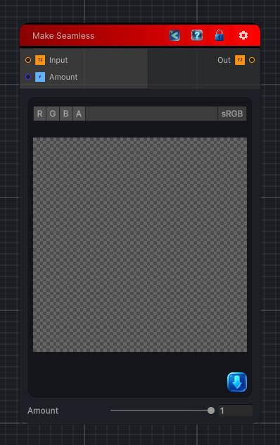

<link rel="stylesheet" href="../_assets/theme.css">

<button type="button" class="genesis-theme-toggle" data-genesis-theme-toggle aria-label="Toggle theme">Dark</button>

---
category: "Filters/Map"
---

# Make Seamless

> Make Seamless, like GIMP Map. Blends the image with a copy of itself offset by half, crossfading so the edges wrap into the centre. The result tiles seamlessly when repeated. Amount controls how strongly the edges are blended.

## Description

Make Seamless, like GIMP Map. Blends the image with a copy of itself offset by half, crossfading so the edges wrap into the centre. The result tiles seamlessly when repeated. Amount controls how strongly the edges are blended.

## Inputs

| Name | Type | Description |
|------|------|-------------|

## Outputs

| Name | Type |
|------|------|

## Parameters

| Setting | Type | Default | Description |
|---------|------|---------|-------------|
| Amount | Range | 1 | Controls the amount. |

## See Also

- [Back to Make Seamless](./filters-index.md)
