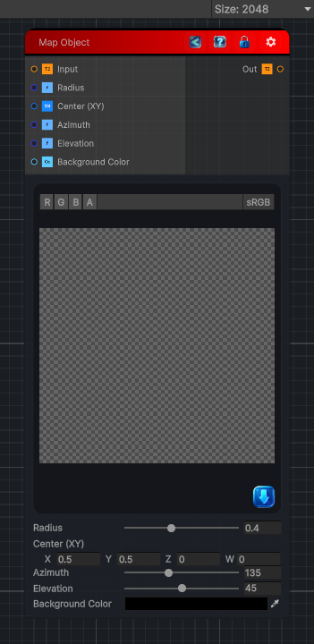

<link rel="stylesheet" href="../_assets/theme.css">

<button type="button" class="genesis-theme-toggle" data-genesis-theme-toggle aria-label="Toggle theme">Dark</button>

---
category: "Filters/Map"
---

# Map Object

> Map Object, like GIMP Map. Maps the image onto a shaded 3D sphere (GIMP's default object) and places it over a background. The image wraps onto the sphere surface and is lit by an azimuth/elevation light; pixels outside the sphere fall to the Background Color. Radius and Center size and position the sphere.

## Description

Map Object, like GIMP Map. Maps the image onto a shaded 3D sphere (GIMP's default object) and places it over a background. The image wraps onto the sphere surface and is lit by an azimuth/elevation light; pixels outside the sphere fall to the Background Color. Radius and Center size and position the sphere.

## Inputs

| Name | Type | Description |
|------|------|-------------|
| Input | Texture2D |  |
| Radius | Single |  |
| Center (XY) | Vector4 |  |
| Azimuth | Single |  |
| Elevation | Single |  |
| Background Color | Color |  |

## Outputs

| Name | Type |
|------|------|
| Out | Texture2D |

## Parameters

| Setting | Type | Default | Description |
|---------|------|---------|-------------|
| Radius | Range | 0.4 | Controls the radius. |
| Center (XY) | Vector | (0.5,0.5,0,0) | Controls the center (xy). |
| Azimuth | Range | 135 | Controls the azimuth. |
| Elevation | Range | 45 | Controls the elevation. |
| Background Color | Color | (0,0,0,0) | Controls the background color. |

## See Also

- [Back to Map Object](./filters-index.md)
