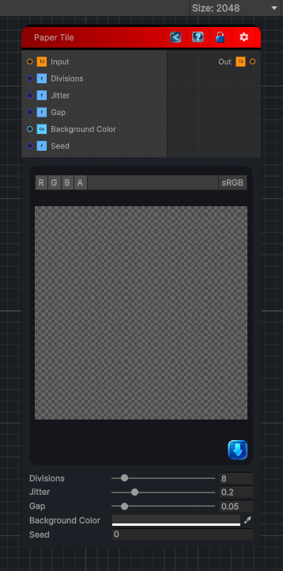

<link rel="stylesheet" href="../_assets/theme.css">

<button type="button" class="genesis-theme-toggle" data-genesis-theme-toggle aria-label="Toggle theme">Dark</button>

---
category: "Filters/Map"
---

# Paper Tile

> Paper Tile, like GIMP Map. Breaks the image into a grid of paper tiles, each shifted by a small random amount, with a gap between tiles filled by the Background Color. Divisions sets the tile count per side, Jitter the per-tile shift, Gap the spacing between tiles, and Seed the random pattern.

## Description

Paper Tile, like GIMP Map. Breaks the image into a grid of paper tiles, each shifted by a small random amount, with a gap between tiles filled by the Background Color. Divisions sets the tile count per side, Jitter the per-tile shift, Gap the spacing between tiles, and Seed the random pattern.

## Inputs

| Name | Type | Description |
|------|------|-------------|
| Input | Texture2D |  |
| Divisions | Single |  |
| Jitter | Single |  |
| Gap | Single |  |
| Background Color | Color |  |
| Seed | Single |  |

## Outputs

| Name | Type |
|------|------|
| Out | Texture2D |

## Parameters

| Setting | Type | Default | Description |
|---------|------|---------|-------------|
| Divisions | Range | 8 | Controls the divisions. |
| Jitter | Range | 0.2 | Controls the jitter. |
| Gap | Range | 0.05 | Controls the gap. |
| Background Color | Color | (0.2,0.2,0.2,1) | Controls the background color. |
| Seed | Float | 0 | Controls the seed. |

## See Also

- [Back to Paper Tile](./filters-index.md)
