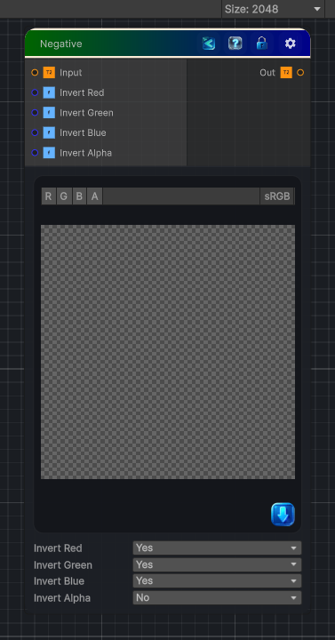

<link rel="stylesheet" href="../_assets/theme.css">

<button type="button" class="genesis-theme-toggle" data-genesis-theme-toggle aria-label="Toggle theme">Dark</button>

---
category: "Filters"
---

# Negative

> Inverts all RGB color channels of the input, producing a photographic negative effect.

## Description

Inverts all RGB color channels of the input, producing a photographic negative effect.

## Inputs

| Name | Type | Description |
|------|------|-------------|

## Outputs

| Name | Type |
|------|------|

## Parameters

| Setting | Type | Default | Description |
|---------|------|---------|-------------|
| Invert Red | Enum | 1 | Invert red channel |
| Invert Green | Enum | 1 | Invert green channel |
| Invert Blue | Enum | 1 | Invert blue channel |
| Invert Alpha | Enum | 0 | Invert alpha channel |

## See Also

- [Back to Negative](./filters-index.md)
