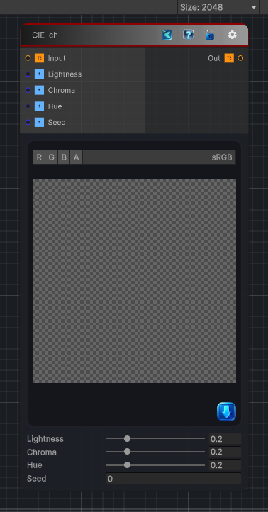

<link rel="stylesheet" href="../_assets/theme.css">

<button type="button" class="genesis-theme-toggle" data-genesis-theme-toggle aria-label="Toggle theme">Dark</button>

---
category: "Filters/Noise"
---

# CIE lch

> CIE lch, like GIMP. Adds random noise to the Lightness, Chroma and Hue channels of the image in the CIE LCh colour space, then converts back to RGB, so colours shift in a perceptually even way. Lightness, Chroma and Hue set the per-channel amounts, Seed the random pattern.

## Description

CIE lch, like GIMP. Adds random noise to the Lightness, Chroma and Hue channels of the image in the CIE LCh colour space, then converts back to RGB, so colours shift in a perceptually even way. Lightness, Chroma and Hue set the per-channel amounts, Seed the random pattern.

## Inputs

| Name | Type | Description |
|------|------|-------------|
| Input | Texture2D |  |
| Lightness | Single |  |
| Chroma | Single |  |
| Hue | Single |  |
| Seed | Single |  |

## Outputs

| Name | Type |
|------|------|
| Out | Texture2D |

## Parameters

| Setting | Type | Default | Description |
|---------|------|---------|-------------|
| Lightness | Range | 0.2 | Controls the lightness. |
| Chroma | Range | 0.2 | Controls the chroma. |
| Hue | Range | 0.2 | Controls the hue. |
| Seed | Float | 0 | Controls the seed. |

## See Also

- [Back to CIE lch](./filters-index.md)
