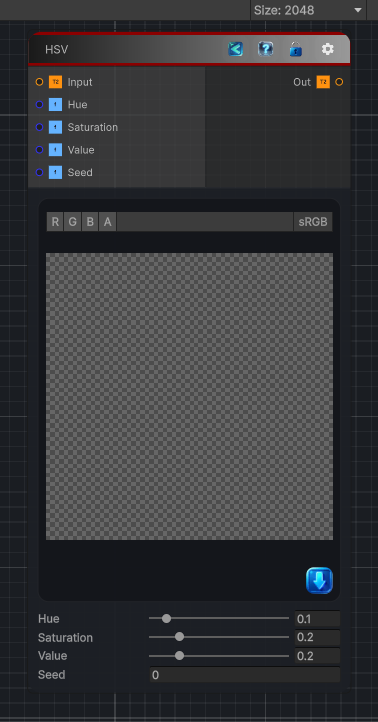

<link rel="stylesheet" href="../_assets/theme.css">

<button type="button" class="genesis-theme-toggle" data-genesis-theme-toggle aria-label="Toggle theme">Dark</button>

---
category: "Filters/Noise"
---

# HSV

> HSV, like GIMP. Adds random noise independently to the Hue, Saturation and Value channels, then converts back to RGB. Hue, Saturation and Value set the per-channel amounts, Seed the random pattern.

## Description

HSV, like GIMP. Adds random noise independently to the Hue, Saturation and Value channels, then converts back to RGB. Hue, Saturation and Value set the per-channel amounts, Seed the random pattern.

## Inputs

| Name | Type | Description |
|------|------|-------------|

## Outputs

| Name | Type |
|------|------|

## Parameters

| Setting | Type | Default | Description |
|---------|------|---------|-------------|
| Hue | Range | 0.1 | Controls the hue. |
| Saturation | Range | 0.2 | Controls the saturation. |
| Value | Range | 0.2 | Controls the value. |
| Seed | Float | 0 | Controls the seed. |

## See Also

- [Back to HSV](./filters-index.md)
