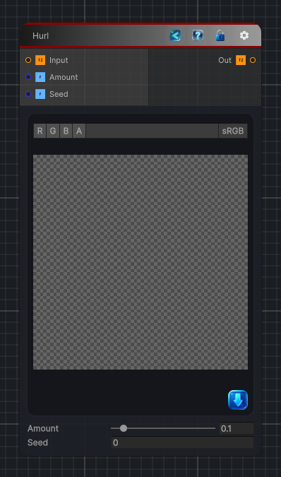

<link rel="stylesheet" href="../_assets/theme.css">

<button type="button" class="genesis-theme-toggle" data-genesis-theme-toggle aria-label="Toggle theme">Dark</button>

---
category: "Filters/Noise"
---

# Hurl

> Hurl, like GIMP. With a given probability replaces each pixel with a completely random colour, producing a static/hurl look. Amount is the chance a pixel is replaced, Seed the random pattern.

## Description

Hurl, like GIMP. With a given probability replaces each pixel with a completely random colour, producing a static/hurl look. Amount is the chance a pixel is replaced, Seed the random pattern.

## Inputs

| Name | Type | Description |
|------|------|-------------|

## Outputs

| Name | Type |
|------|------|

## Parameters

| Setting | Type | Default | Description |
|---------|------|---------|-------------|
| Amount | Range | 0.1 | Controls the amount. |
| Seed | Float | 0 | Controls the seed. |

## See Also

- [Back to Hurl](./filters-index.md)
