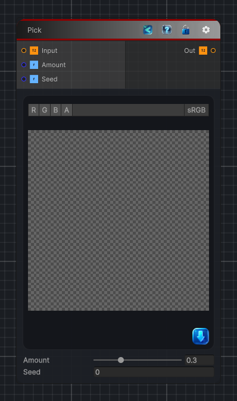

<link rel="stylesheet" href="../_assets/theme.css">

<button type="button" class="genesis-theme-toggle" data-genesis-theme-toggle aria-label="Toggle theme">Dark</button>

---
category: "Filters/Noise"
---

# Pick

> Pick, like GIMP. With a given probability replaces each pixel with the colour of a randomly chosen neighbour from its 3x3 block, shuffling detail. Amount is the chance a pixel is replaced, Seed the random pattern.

## Description

Pick, like GIMP. With a given probability replaces each pixel with the colour of a randomly chosen neighbour from its 3x3 block, shuffling detail. Amount is the chance a pixel is replaced, Seed the random pattern.

## Inputs

| Name | Type | Description |
|------|------|-------------|
| Input | Texture2D |  |
| Amount | Single |  |
| Seed | Single |  |

## Outputs

| Name | Type |
|------|------|
| Out | Texture2D |

## Parameters

| Setting | Type | Default | Description |
|---------|------|---------|-------------|
| Amount | Range | 0.3 | Controls the amount. |
| Seed | Float | 0 | Controls the seed. |

## See Also

- [Back to Pick](./filters-index.md)
