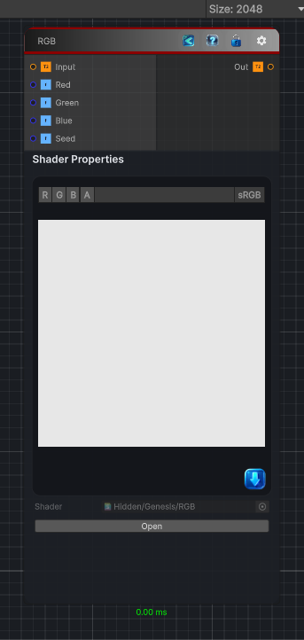

<link rel="stylesheet" href="../_assets/theme.css">

<button type="button" class="genesis-theme-toggle" data-genesis-theme-toggle aria-label="Toggle theme">Dark</button>

---
category: "Filters/Noise"
---

# RGB

> RGB, like GIMP. Adds independent random noise to the Red, Green and Blue channels. Red, Green and Blue set the per-channel amounts, Seed the random pattern.

## Description

RGB, like GIMP. Adds independent random noise to the Red, Green and Blue channels. Red, Green and Blue set the per-channel amounts, Seed the random pattern.

## Inputs

| Name | Type | Description |
|------|------|-------------|
| Input | Texture2D |  |
| Red | Single |  |
| Green | Single |  |
| Blue | Single |  |
| Seed | Single |  |

## Outputs

| Name | Type |
|------|------|
| Out | Texture2D |

## Parameters

| Setting | Type | Default | Description |
|---------|------|---------|-------------|
| Red | Range | 0.2 | Controls the red. |
| Green | Range | 0.2 | Controls the green. |
| Blue | Range | 0.2 | Controls the blue. |
| Seed | Float | 0 | Controls the seed. |

## See Also

- [Back to RGB](./filters-index.md)
