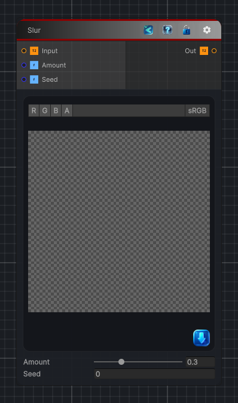

<link rel="stylesheet" href="../_assets/theme.css">

<button type="button" class="genesis-theme-toggle" data-genesis-theme-toggle aria-label="Toggle theme">Dark</button>

---
category: "Filters/Noise"
---

# Slur

> Slur, like GIMP. With a given probability mixes each pixel with a randomly chosen neighbour, smearing the image. Amount is the chance a pixel is smeared, Seed the random pattern.

## Description

Slur, like GIMP. With a given probability mixes each pixel with a randomly chosen neighbour, smearing the image. Amount is the chance a pixel is smeared, Seed the random pattern.

## Inputs

| Name | Type | Description |
|------|------|-------------|

## Outputs

| Name | Type |
|------|------|

## Parameters

| Setting | Type | Default | Description |
|---------|------|---------|-------------|
| Amount | Range | 0.3 | Controls the amount. |
| Seed | Float | 0 | Controls the seed. |

## See Also

- [Back to Slur](./filters-index.md)
