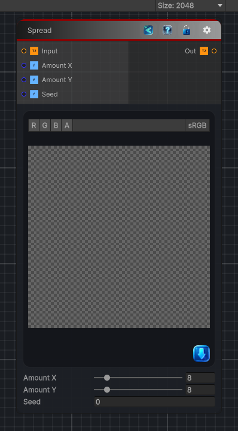

<link rel="stylesheet" href="../_assets/theme.css">

<button type="button" class="genesis-theme-toggle" data-genesis-theme-toggle aria-label="Toggle theme">Dark</button>

---
category: "Filters/Noise"
---

# Spread

> Spread, like GIMP. Displaces each pixel to a random nearby position, scrambling the image spatially. Amount X and Amount Y are the spread radius in pixels per axis, Seed the random pattern.

## Description

Spread, like GIMP. Displaces each pixel to a random nearby position, scrambling the image spatially. Amount X and Amount Y are the spread radius in pixels per axis, Seed the random pattern.

## Inputs

| Name | Type | Description |
|------|------|-------------|

## Outputs

| Name | Type |
|------|------|

## Parameters

| Setting | Type | Default | Description |
|---------|------|---------|-------------|
| Amount X | Range | 8 | Controls the amount x. |
| Amount Y | Range | 8 | Controls the amount y. |
| Seed | Float | 0 | Controls the seed. |

## See Also

- [Back to Spread](./filters-index.md)
