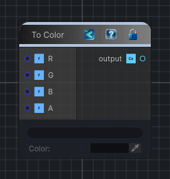

<link rel="stylesheet" href="../_assets/theme.css">

<button type="button" class="genesis-theme-toggle" data-genesis-theme-toggle aria-label="Toggle theme">Dark</button>

---
category: "Function/Cast"
---

# To Color

> Casts the input value to Color.

## Description

Casts the input value to Color.

## Inputs

| Name | Type | Description |
|------|------|-------------|

## Outputs

| Name | Type |
|------|------|

## Parameters

| Setting | Type | Default | Description |
|---------|------|---------|-------------|
| nodeVariables | VariableStorage | AhahGames.GenesisNoise.Graph.VariableStorage | |
| GUID | String | c2bdca02-73a6-42f6-b3c5-a9e0a225c51d | |
| expanded | Boolean | False | |

## See Also

- [Back to To Color](./function-index.md)
