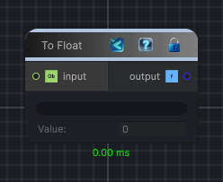

<link rel="stylesheet" href="../_assets/theme.css">

<button type="button" class="genesis-theme-toggle" data-genesis-theme-toggle aria-label="Toggle theme">Dark</button>

---
category: "Function/Cast"
---

# To Float

> Casts the input value to Float.

## Description

Casts the input value to Float.

## Inputs

| Name | Type | Description |
|------|------|-------------|
| input | Object |  |

## Outputs

| Name | Type |
|------|------|
| output | Single |

## Parameters

| Setting | Type | Default | Description |
|---------|------|---------|-------------|
| nodeVariables | VariableStorage | AhahGames.GenesisNoise.Graph.VariableStorage | |
| GUID | String | 64a5fc21-b72e-4c1d-b61f-336f70e91f49 | |
| expanded | Boolean | False | |

## See Also

- [Back to To Float](./function-index.md)
