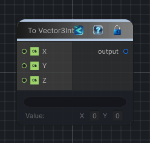

<link rel="stylesheet" href="../_assets/theme.css">

<button type="button" class="genesis-theme-toggle" data-genesis-theme-toggle aria-label="Toggle theme">Dark</button>

---
category: "Function/Cast"
---

# To Vector3Int

> Casts the input value to Vector3Int.

## Description

Casts the input value to Vector3Int.

## Inputs

| Name | Type | Description |
|------|------|-------------|
| Z | Object |  |
| Y | Object |  |
| X | Object |  |

## Outputs

| Name | Type |
|------|------|
| output | Vector3Int |

## Parameters

| Setting | Type | Default | Description |
|---------|------|---------|-------------|
| nodeVariables | VariableStorage | AhahGames.GenesisNoise.Graph.VariableStorage | |
| GUID | String | fc8b3615-f601-48f5-a1d1-8733866e0719 | |
| expanded | Boolean | False | |

## See Also

- [Back to To Vector3Int](./function-index.md)
