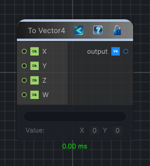

<link rel="stylesheet" href="../_assets/theme.css">

<button type="button" class="genesis-theme-toggle" data-genesis-theme-toggle aria-label="Toggle theme">Dark</button>

---
category: "Function/Cast"
---

# To Vector4

> Casts the input value to Vector4.

## Description

Casts the input value to Vector4.

## Inputs

| Name | Type | Description |
|------|------|-------------|
| W | Object |  |
| Z | Object |  |
| Y | Object |  |
| X | Object |  |

## Outputs

| Name | Type |
|------|------|
| output | Vector4 |

## Parameters

| Setting | Type | Default | Description |
|---------|------|---------|-------------|
| nodeVariables | VariableStorage | AhahGames.GenesisNoise.Graph.VariableStorage | |
| GUID | String | 11d74be6-2621-47b5-a2b2-9d5a5729d0c5 | |
| expanded | Boolean | False | |

## See Also

- [Back to To Vector4](./function-index.md)
