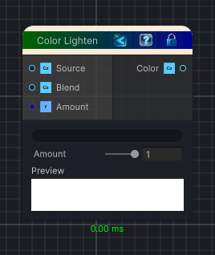

<link rel="stylesheet" href="../_assets/theme.css">

<button type="button" class="genesis-theme-toggle" data-genesis-theme-toggle aria-label="Toggle theme">Dark</button>

---
category: "Function/Color"
---

# Lighten

> Returns the per-channel lighter value of two Colors.

## Description

Returns the per-channel lighter value of two Colors.

Source and Blend are compared independently for red, green, blue, and alpha. Amount blends between the original Source and the fully lightened result.

## Inputs

| Name | Type | Description |
|------|------|-------------|
| Amount | Single |  |
| Blend | Color |  |
| Source | Color |  |

## Outputs

| Name | Type |
|------|------|
| Color | Color |

## Parameters

| Setting | Type | Default | Description |
|---------|------|---------|-------------|
| nodeVariables | VariableStorage | AhahGames.GenesisNoise.Graph.VariableStorage | |
| GUID | String | 95433c34-adf7-42fc-8da6-749a725a44ff | |
| expanded | Boolean | False | |

## See Also

- [Back to Lighten](./function-index.md)
