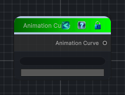

<link rel="stylesheet" href="../_assets/theme.css">

<button type="button" class="genesis-theme-toggle" data-genesis-theme-toggle aria-label="Toggle theme">Dark</button>

---
category: "Function/Constant"
---

# Animation Curve

> Outputs a constant animation curve value.

## Description

Outputs a constant animation curve value.

## Inputs

| Name | Type | Description |
|------|------|-------------|

## Outputs

| Name | Type |
|------|------|

## Parameters

| Setting | Type | Default | Description |
|---------|------|---------|-------------|
| nodeVariables | VariableStorage | AhahGames.GenesisNoise.Graph.VariableStorage | |
| GUID | String | 4e31b32e-461b-44f9-be03-abeb714a1990 | |
| expanded | Boolean | False | |

## See Also

- [Back to Animation Curve](./function-index.md)
