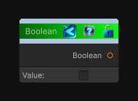

<link rel="stylesheet" href="../_assets/theme.css">

<button type="button" class="genesis-theme-toggle" data-genesis-theme-toggle aria-label="Toggle theme">Dark</button>

---
category: "Function/Constant"
---

# Boolean

> Outputs a constant boolean value.

## Description

Outputs a constant boolean value.

## Inputs

| Name | Type | Description |
|------|------|-------------|

## Outputs

| Name | Type |
|------|------|

## Parameters

| Setting | Type | Default | Description |
|---------|------|---------|-------------|
| nodeVariables | VariableStorage | AhahGames.GenesisNoise.Graph.VariableStorage | |
| GUID | String | b6ae249c-44ff-4126-8236-44e4871170fb | |
| expanded | Boolean | False | |

## See Also

- [Back to Boolean](./function-index.md)
