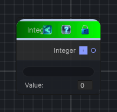

<link rel="stylesheet" href="../_assets/theme.css">

<button type="button" class="genesis-theme-toggle" data-genesis-theme-toggle aria-label="Toggle theme">Dark</button>

---
category: "Function/Constant"
---

# Integer

> Outputs a constant integer value.

## Description

Outputs a constant integer value.

## Inputs

| Name | Type | Description |
|------|------|-------------|

## Outputs

| Name | Type |
|------|------|
| Integer | Int32 |

## Parameters

| Setting | Type | Default | Description |
|---------|------|---------|-------------|
| nodeVariables | VariableStorage | AhahGames.GenesisNoise.Graph.VariableStorage | |
| GUID | String | 1af7823c-4284-4a16-aa63-32f508012c6d | |
| expanded | Boolean | False | |

## See Also

- [Back to Integer](./function-index.md)
