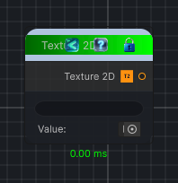

<link rel="stylesheet" href="../_assets/theme.css">

<button type="button" class="genesis-theme-toggle" data-genesis-theme-toggle aria-label="Toggle theme">Dark</button>

---
category: "Function/Constant"
---

# Texture 2D

> Outputs a constant texture 2d value.

## Description

Outputs a constant texture 2d value.

## Inputs

| Name | Type | Description |
|------|------|-------------|

## Outputs

| Name | Type |
|------|------|
| Texture 2D | Texture2D |

## Parameters

| Setting | Type | Default | Description |
|---------|------|---------|-------------|
| nodeVariables | VariableStorage | AhahGames.GenesisNoise.Graph.VariableStorage | |
| GUID | String | d99091ff-ef0b-49b3-9d99-5955ec5c9dc1 | |
| expanded | Boolean | False | |

## See Also

- [Back to Texture 2D](./function-index.md)
