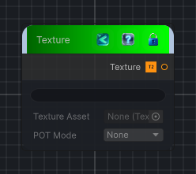

<link rel="stylesheet" href="../_assets/theme.css">

<button type="button" class="genesis-theme-toggle" data-genesis-theme-toggle aria-label="Toggle theme">Dark</button>

---
category: "Function/Constant"
---

# Texture

> The Texture node can accept any type of texture in parameter (2D, 3D, 2DArray, Cube, CubeArray, RenderTexture).

## Description

The Texture node can accept any type of texture in parameter (2D, 3D, 2DArray, Cube, CubeArray, RenderTexture).
The output type of the node will update according to the type of texture provided. In case the texture type changes, the output edges may be destroyed.

## Inputs

| Name | Type | Description |
|------|------|-------------|

## Outputs

| Name | Type |
|------|------|
| Texture | Texture2D |

## Parameters

| Setting | Type | Default | Description |
|---------|------|---------|-------------|
| textureAsset | Texture | — | |
| POTMode | PowerOf2Mode | None | |
| nodeVariables | VariableStorage | AhahGames.GenesisNoise.Graph.VariableStorage | |
| GUID | String | 8ece3395-ab07-4843-a851-cf587d8334ef | |
| expanded | Boolean | False | |

## See Also

- [Back to Texture](./function-index.md)
