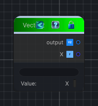

<link rel="stylesheet" href="../_assets/theme.css">

<button type="button" class="genesis-theme-toggle" data-genesis-theme-toggle aria-label="Toggle theme">Dark</button>

---
category: "Function/Constant"
---

# Vector2

> Outputs a constant vector2 value.

## Description

Outputs a constant vector2 value.

## Inputs

| Name | Type | Description |
|------|------|-------------|

## Outputs

| Name | Type |
|------|------|
| X | Single |
| output | Vector2 |

## Parameters

| Setting | Type | Default | Description |
|---------|------|---------|-------------|
| Y | Single | 0 | |
| nodeVariables | VariableStorage | AhahGames.GenesisNoise.Graph.VariableStorage | |
| GUID | String | 4ba49a5a-9512-4ac8-8575-7414543e043a | |
| expanded | Boolean | False | |

## See Also

- [Back to Vector2](./function-index.md)
