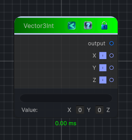

<link rel="stylesheet" href="../_assets/theme.css">

<button type="button" class="genesis-theme-toggle" data-genesis-theme-toggle aria-label="Toggle theme">Dark</button>

---
category: "Function/Constant"
---

# Vector3Int

> Outputs a constant vector3int value.

## Description

Outputs a constant vector3int value.

## Inputs

| Name | Type | Description |
|------|------|-------------|

## Outputs

| Name | Type |
|------|------|
| Z | Int32 |
| Y | Int32 |
| X | Int32 |
| output | Vector3Int |

## Parameters

| Setting | Type | Default | Description |
|---------|------|---------|-------------|
| nodeVariables | VariableStorage | AhahGames.GenesisNoise.Graph.VariableStorage | |
| GUID | String | 7cacabeb-1ed6-4882-8f61-a941fe70102a | |
| expanded | Boolean | False | |

## See Also

- [Back to Vector3Int](./function-index.md)
