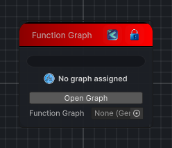

<link rel="stylesheet" href="../_assets/theme.css">

<button type="button" class="genesis-theme-toggle" data-genesis-theme-toggle aria-label="Toggle theme">Dark</button>

---
category: "Functions"
---

# Function Graph

> Wraps a Genesis graph as a reusable function node. Input ports mirror the backing graph's exposed parameters, and output ports mirror its output textures.

## Description

Wraps a Genesis graph as a reusable function node. Input ports mirror the backing graph's exposed parameters, and output ports mirror its output textures.

## Inputs

| Name | Type | Description |
|------|------|-------------|

## Outputs

| Name | Type |
|------|------|

## Parameters

| Setting | Type | Default | Description |
|---------|------|---------|-------------|
| functionGraph | GenesisGraph | — | |
| nodeVariables | VariableStorage | AhahGames.GenesisNoise.Graph.VariableStorage | |
| GUID | String | 248e6158-af82-4379-bce0-30b2c8e76ff3 | |
| expanded | Boolean | False | |

## See Also

- [Back to Function Graph](./functions-index.md)
