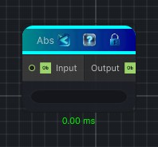

<link rel="stylesheet" href="../_assets/theme.css">

<button type="button" class="genesis-theme-toggle" data-genesis-theme-toggle aria-label="Toggle theme">Dark</button>

---
category: "Function/Math"
---

# Abs

> Returns the absolute value of the input.

## Description

Returns the absolute value of the input.

## Inputs

| Name | Type | Description |
|------|------|-------------|
| Input | Object |  |

## Outputs

| Name | Type |
|------|------|
| Output | Object |

## Parameters

| Setting | Type | Default | Description |
|---------|------|---------|-------------|
| nodeVariables | VariableStorage | AhahGames.GenesisNoise.Graph.VariableStorage | |
| GUID | String | 164dffc7-05a7-425d-9e50-19afb48c836b | |
| expanded | Boolean | False | |

## See Also

- [Back to Abs](./function-index.md)
