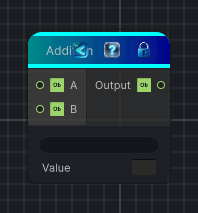

<link rel="stylesheet" href="../_assets/theme.css">

<button type="button" class="genesis-theme-toggle" data-genesis-theme-toggle aria-label="Toggle theme">Dark</button>

---
category: "Function/Math"
---

# Addition

> Adds the input values.

## Description

Adds the input values.

## Inputs

| Name | Type | Description |
|------|------|-------------|
| B | Object |  |
| A | Object |  |

## Outputs

| Name | Type |
|------|------|
| Output | Object |

## Parameters

| Setting | Type | Default | Description |
|---------|------|---------|-------------|
| nodeVariables | VariableStorage | AhahGames.GenesisNoise.Graph.VariableStorage | |
| GUID | String | 48b9596e-3806-46c0-9ec0-3e51d5233f1d | |
| expanded | Boolean | False | |

## See Also

- [Back to Addition](./function-index.md)
