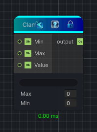

<link rel="stylesheet" href="../_assets/theme.css">

<button type="button" class="genesis-theme-toggle" data-genesis-theme-toggle aria-label="Toggle theme">Dark</button>

---
category: "Function/Math"
---

# Clamp

> Clamps the input to a specified range.

## Description

Clamps the input to a specified range.

## Inputs

| Name | Type | Description |
|------|------|-------------|
| Value | Object |  |
| Max | Object |  |
| Min | Object |  |

## Outputs

| Name | Type |
|------|------|
| output | Object |

## Parameters

| Setting | Type | Default | Description |
|---------|------|---------|-------------|
| nodeVariables | VariableStorage | AhahGames.GenesisNoise.Graph.VariableStorage | |
| GUID | String | eb36b832-6982-4dce-9187-69adca59d32b | |
| expanded | Boolean | False | |

## See Also

- [Back to Clamp](./function-index.md)
