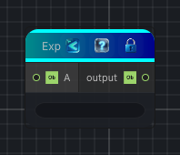

<link rel="stylesheet" href="../_assets/theme.css">

<button type="button" class="genesis-theme-toggle" data-genesis-theme-toggle aria-label="Toggle theme">Dark</button>

---
category: "Function/Math"
---

# Exp

> Raises e to the power of the input.

## Description

Raises e to the power of the input.

## Inputs

| Name | Type | Description |
|------|------|-------------|

## Outputs

| Name | Type |
|------|------|

## Parameters

| Setting | Type | Default | Description |
|---------|------|---------|-------------|
| nodeVariables | VariableStorage | AhahGames.GenesisNoise.Graph.VariableStorage | |
| GUID | String | cd9702dc-f165-492a-a0b0-7d6e9b76c8aa | |
| expanded | Boolean | False | |

## See Also

- [Back to Exp](./function-index.md)
