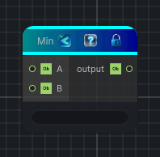

<link rel="stylesheet" href="../_assets/theme.css">

<button type="button" class="genesis-theme-toggle" data-genesis-theme-toggle aria-label="Toggle theme">Dark</button>

---
category: "Function/Math"
---

# Min

> Returns the smaller of the input values.

## Description

Returns the smaller of the input values.

## Inputs

| Name | Type | Description |
|------|------|-------------|
| B | Object |  |
| A | Object |  |

## Outputs

| Name | Type |
|------|------|
| output | Object |

## Parameters

| Setting | Type | Default | Description |
|---------|------|---------|-------------|
| nodeVariables | VariableStorage | AhahGames.GenesisNoise.Graph.VariableStorage | |
| GUID | String | c97d209b-eb46-4e28-8677-8ac2fb6bed9c | |
| expanded | Boolean | False | |

## See Also

- [Back to Min](./function-index.md)
