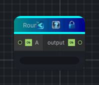

<link rel="stylesheet" href="../_assets/theme.css">

<button type="button" class="genesis-theme-toggle" data-genesis-theme-toggle aria-label="Toggle theme">Dark</button>

---
category: "Function/Math"
---

# Round

> Rounds the input to the nearest integer value.

## Description

Rounds the input to the nearest integer value.

## Inputs

| Name | Type | Description |
|------|------|-------------|

## Outputs

| Name | Type |
|------|------|

## Parameters

| Setting | Type | Default | Description |
|---------|------|---------|-------------|
| nodeVariables | VariableStorage | AhahGames.GenesisNoise.Graph.VariableStorage | |
| GUID | String | d0487374-5dd2-4453-aa71-6729f1f8bf87 | |
| expanded | Boolean | False | |

## See Also

- [Back to Round](./function-index.md)
