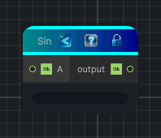

<link rel="stylesheet" href="../_assets/theme.css">

<button type="button" class="genesis-theme-toggle" data-genesis-theme-toggle aria-label="Toggle theme">Dark</button>

---
category: "Function/Math"
---

# Sin

> Returns the sine of the input.

## Description

Returns the sine of the input.

## Inputs

| Name | Type | Description |
|------|------|-------------|
| A | Object |  |

## Outputs

| Name | Type |
|------|------|
| output | Object |

## Parameters

| Setting | Type | Default | Description |
|---------|------|---------|-------------|
| nodeVariables | VariableStorage | AhahGames.GenesisNoise.Graph.VariableStorage | |
| GUID | String | ff46ce20-5d06-4eaa-9c52-6ae8ebe5705a | |
| expanded | Boolean | False | |

## See Also

- [Back to Sin](./function-index.md)
