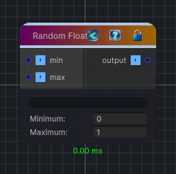

<link rel="stylesheet" href="../_assets/theme.css">

<button type="button" class="genesis-theme-toggle" data-genesis-theme-toggle aria-label="Toggle theme">Dark</button>

---
category: "Function/Random"
---

# Float

> Generates a random float value.

## Description

Generates a random float value.

## Inputs

| Name | Type | Description |
|------|------|-------------|
| max | Single |  |
| min | Single |  |

## Outputs

| Name | Type |
|------|------|
| output | Single |

## Parameters

| Setting | Type | Default | Description |
|---------|------|---------|-------------|
| nodeVariables | VariableStorage | AhahGames.GenesisNoise.Graph.VariableStorage | |
| GUID | String | a1613dc0-6f9b-4e85-b3b9-dc6486b7634b | |
| expanded | Boolean | False | |

## See Also

- [Back to Float](./function-index.md)
